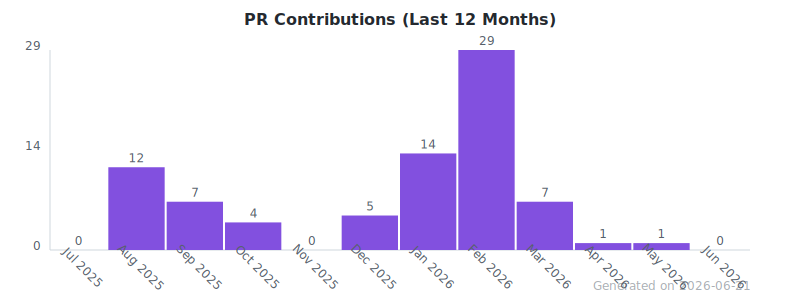

## dongowu

**Rust / Go Engineer · Full-Stack Builder · Open Source Contributor**

---

### About

Backend engineer building high-performance systems with Rust and Go. Focused on developer tooling, agent infrastructure, and automation. Based in China, open to collaborating on practical open-source projects.

---

### Featured Projects

| Project | Lang | Description |
|---------|------|-------------|
| [git-ai-cli](https://github.com/dongowu/git-ai-cli) | Rust | AI-driven Git commit message generator |
| [EcoPilot](https://github.com/dongowu/EcoPilot) | Python | Agent governance platform |
| [agentos](https://github.com/dongowu/agentos) | Go | Agent OS core |
| [sentinel-protocol](https://github.com/dongowu/sentinel-protocol) | Go | Agent security on Sui |

---

### Tech Stack

**Languages:**

**Infra:**

---

### GitHub Stats

  
  

---

### Contributions

  <picture>
    <source media="(prefers-color-scheme: dark)" srcset="./dist/github-contribution-grid-snake-dark.svg" />
    <source media="(prefers-color-scheme: light)" srcset="./dist/github-contribution-grid-snake.svg" />
    
  </picture>

  

---

<em>Code is poetry written in logic.</em>

