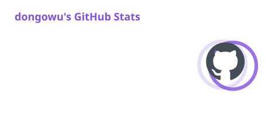
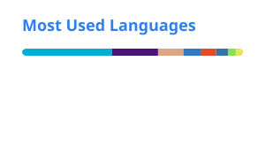

  <picture>
    <source media="(prefers-color-scheme: dark)" srcset="https://readme-typing-svg.demolab.com?font=Fira+Code&weight=600&size=28&pause=1000&color=8250DF&center=true&vCenter=true&width=520&lines=Hey+%F0%9F%91%8B%2C+I%27m+dongowu;Agent+Infrastructure+Engineer;Go+%2B+Rust+Backend;Open+Source+Builder">
    
  </picture>

  
  
  
  

 

<!-- STATS SECTION -->

  <table>
    <tr>
      <td align="center" width="50%">
        <picture>
          <source media="(prefers-color-scheme: dark)" srcset="./profile/stats-dark.svg" />
          
        </picture>
      </td>
      <td align="center" width="50%">
        <picture>
          <source media="(prefers-color-scheme: dark)" srcset="https://streak-stats.demolab.com?user=dongowu&theme=tokyonight&hide_border=true&background=00000000&card_width=450">
          
        </picture>
      </td>
    </tr>
    <tr>
      <td align="center" colspan="2">
        <picture>
          <source media="(prefers-color-scheme: dark)" srcset="./profile/top-langs-dark.svg" />
          
        </picture>
      </td>
    </tr>
  </table>

 

---

## 👨‍💻 About Me

I build **agent execution infrastructure** — Go control planes, Rust runtimes, and the unglamorous layers around them: scheduling, governance, auditability, observability.

Most agent projects stop at the demo. I care about what comes after: how an autonomous workload gets **bounded, audited, and explained** once it runs unattended.

- 🔭 Building **[AgentOS](https://github.com/dongowu/agentos)** — a self-hosted execution platform that treats agents as governed workloads
- 🛡️ Exploring **verifiable agent security** — policy gates with on-chain audit anchors
- 🧰 Maintaining **[git-ai-cli](https://github.com/dongowu/git-ai-cli)** — a multi-model, local-first AI Git assistant on npm
- 🌱 Going deeper on **Rust async internals** and **Go concurrency patterns**
- ⚡ I automate anything I do more than twice

---

## 🚀 Featured Projects

**Agent infrastructure**

- **[AgentOS](https://github.com/dongowu/agentos)** &nbsp;`Go` `Rust` — 自托管代理执行平台，Go 控制面 + Rust 运行时面。任务编排与执行生命周期、本地 / NATS 双调度路径、审计与回放、SSE 遥测、agent loop 与工具调用，以及 tools / skills / adapters 扩展点。
- **[Sentinel Protocol](https://github.com/dongowu/sentinel-protocol)** &nbsp;`Go` — 面向 OpenClaw + Sui 的可验证执行前安全层。每次 agent 动作都经策略门与多信号风险引擎评分，给出 **ALLOW / 需人工审批 / 拦截**，并把决策以 Merkle 批次锚定到 Sui，形成不可篡改的审计证据。

**Developer tooling**

- **[git-ai-cli](https://github.com/dongowu/git-ai-cli)** &nbsp;`Rust` · [npm](https://www.npmjs.com/package/@dongowu/git-ai-cli) — 分支感知的 AI Git 助手：提交信息生成、Copilot 守护、智能周报。支持 DeepSeek / 通义千问 / 智谱 GLM / Moonshot / Ollama，可完全本地部署，代码不出内网。
- **[AgentPulse](https://github.com/dongowu/ai-tracker)** &nbsp;`Rust` — AI 编码代理的可观测性工具：统计与 Claude Code、Codex、Cursor 等代理协作的会话数、时长、连续天数，以及工具与模型的使用分布。

**Multi-agent applications**

- **[Pledgekit](https://github.com/dongowu/SpecAssetPages)** &nbsp;`Go` `React` `TypeScript` — 多智能体系统：从一句产品描述生成 7 类众筹营销资产（品牌名、标语、主文案、功能要点、产品渲染图、生活场景图、奖励层级）。DeepSeek 负责文本、FLUX 1.1 Pro 负责图像，Cloudflare D1 / R2 承载数据与存储。
- **[alpha-research-agent](https://github.com/dongowu/alpha-research-agent)** &nbsp;`Go` — 加密资产研究代理：聚合行情、链上与 DEX 数据及风险信号，提供快讯 / 深入 / 长文等多档研究输出。

**Engineering productivity**

- **[EcoPilot](https://github.com/dongowu/EcoPilot)** &nbsp;`Python` — 面向可持续 CI/CD 的 GitLab Duo 智能体流程：识别 CI 浪费（缺缓存、冗余步骤、测试范围过宽等），量化运行时长、成本与碳排收益，并直接开出确定性修复的合并请求。
- **[release-pilot](https://github.com/dongowu/release-pilot)** &nbsp;`Go` `TypeScript` — GitHub Release 通知机器人：订阅仓库、按规则过滤版本，模板渲染后推送到指定频道，支持 Webhook 与可视化配置。

---

## 🛠️ Tech Stack

### Languages

### Backend & Infrastructure

### AI & Blockchain

---

## 📊 Contribution Activity

  

   
   

  <picture>
    <source media="(prefers-color-scheme: dark)" srcset="./dist/github-contribution-grid-snake-dark.svg" />
    <source media="(prefers-color-scheme: light)" srcset="./dist/github-contribution-grid-snake.svg" />
    
  </picture>

---

## 🌱 Open Source Contributions

<!--CONTRIBUTIONS_START-->
- **[GoPolymarket/polymarket-go-sdk](https://github.com/GoPolymarket/polymarket-go-sdk/pull/64)**: fix(clob): restore json.Number salt for POLY_1271 order payloads
- **[hoh-zone/Overflow2026-CNNo1](https://github.com/hoh-zone/Overflow2026-CNNo1/pull/5)**: add project description
- **[GoPolymarket/polymarket-go-sdk](https://github.com/GoPolymarket/polymarket-go-sdk/pull/42)**: fix(clob): support flexible order time fields & make govulncheck advisory
- **[MystenLabs/sui](https://github.com/MystenLabs/sui/pull/26038)**: [types][cleanup] fix typo: barreier -> barrier in governance.rs
- **[MystenLabs/sui](https://github.com/MystenLabs/sui/pull/25828)**: fix(kvstore): decode balance_changes and unchanged_loaded_runtime_objects from KV store
<!--CONTRIBUTIONS_END-->

---

  📈 Stats &amp; language cards are rendered in CI and committed as local SVGs — no third-party service in the critical path.
   
  🐍 Snake by <a href="https://github.com/Platane/snk">Platane/snk</a> · 📊 Cards by <a href="https://github.com/readme-tools/github-readme-stats-action">readme-tools</a> · 🏷️ Badges by <a href="https://shields.io">shields.io</a>

