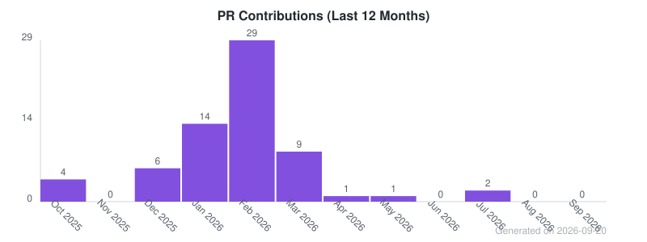

  <picture>
    <source media="(prefers-color-scheme: dark)" srcset="https://readme-typing-svg.demolab.com?font=Fira+Code&weight=600&size=28&pause=1000&color=8250DF&center=true&vCenter=true&width=435&lines=Hey+%F0%9F%91%8B%2C+I'm+dongowu;Rust+%2F+Go+Engineer;Open+Source+Contributor;Full-Stack+Builder">
    
  </picture>

  
  
  
  
   
  
  
  
  

 

<!-- STATS SECTION -->

  <table>
    <tr>
      <td align="center" width="50%">
        <picture>
          <source media="(prefers-color-scheme: dark)" srcset="https://github-readme-stats.vercel.app/api?username=dongowu&show_icons=true&theme=tokyonight&include_all_commits=true&count_private=true&hide_border=true&rank_icon=github&bg_color=00000000">
          
        </picture>
      </td>
      <td align="center" width="50%">
        <picture>
          <source media="(prefers-color-scheme: dark)" srcset="https://streak-stats.demolab.com?user=dongowu&theme=tokyonight&hide_border=true&background=00000000&card_width=450">
          
        </picture>
      </td>
    </tr>
    <tr>
      <td align="center" colspan="2">
        <picture>
          <source media="(prefers-color-scheme: dark)" srcset="https://github-readme-stats.vercel.app/api/top-langs/?username=dongowu&layout=compact&langs_count=8&theme=tokyonight&hide_border=true&bg_color=00000000">
          
        </picture>
      </td>
    </tr>
  </table>

 

<!-- TROPHIES -->

  <picture>
    <source media="(prefers-color-scheme: dark)" srcset="https://github-profile-trophy.vercel.app/?username=dongowu&theme=tokyonight&no-frame=true&no-bg=true&row=2&column=4&margin-w=15&margin-h=15">
    
  </picture>

 

---

## 👨‍💻 About Me

Backend engineer building high-performance systems with **Rust** and **Go**. Focused on developer tooling, agent infrastructure, and automation. Based in China, open to collaborating on practical open-source projects.

- 🔭 Currently working on **agent infrastructure & blockchain tooling**
- 🌱 Deepening my expertise in **Rust async runtime internals & Go concurrency patterns**
- 👯 Looking to collaborate on **developer tools, agent platforms, and Sui/Move ecosystem**
- ⚡ Fun fact: I automate everything I do more than twice

---

## 🛠️ Tech Stack

### Languages

### Infrastructure & Tools

### Blockchain & Web3

## 📊 Contribution Activity

  <!-- Activity Graph -->
  <picture>
    <source media="(prefers-color-scheme: dark)" srcset="https://github-readme-activity-graph.vercel.app/graph?username=dongowu&theme=tokyo-night&hide_border=true&bg_color=00000000&area=true&point=8250DF&line=8250DF&radius=8">
    
  </picture>

   
   

  <!-- Snake Animation -->
  <picture>
    <source media="(prefers-color-scheme: dark)" srcset="./dist/github-contribution-grid-snake-dark.svg" />
    <source media="(prefers-color-scheme: light)" srcset="./dist/github-contribution-grid-snake.svg" />
    
  </picture>

   
   

  <!-- PR Contribution Graph -->
  

---

## ⏱️ Coding Activity

<!--START_SECTION:waka-->
<!--END_SECTION:waka-->

---

## 🚀 Open Source Contributions

<!--CONTRIBUTIONS_START-->
- **[hoh-zone/Overflow2026-CNNo1](https://github.com/hoh-zone/Overflow2026-CNNo1/pull/5)**: add project description
- **[GoPolymarket/polymarket-go-sdk](https://github.com/GoPolymarket/polymarket-go-sdk/pull/42)**: fix(clob): support flexible order time fields & make govulncheck advisory
- **[MystenLabs/sui](https://github.com/MystenLabs/sui/pull/26038)**: [types][cleanup] fix typo: barreier -> barrier in governance.rs
- **[MystenLabs/sui](https://github.com/MystenLabs/sui/pull/25828)**: fix(kvstore): decode balance_changes and unchanged_loaded_runtime_objects from KV store
- **[MystenLabs/sui](https://github.com/MystenLabs/sui/pull/25824)**: refactor(indexer-alt): use query! macro in prune handlers
<!--CONTRIBUTIONS_END-->

---

  ✨ Profile auto-updated via GitHub Actions · Generated on 2026-07-03
   
  📊 Stats powered by <a href="https://github.com/anuraghazra/github-readme-stats">github-readme-stats</a> · 🐍 Snake by <a href="https://github.com/Platane/snk">Platane/snk</a> · 🏆 Trophies by <a href="https://github.com/ryo-ma/github-profile-trophy">ryo-ma</a>

