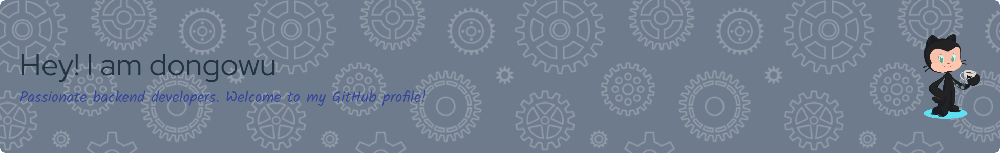

<div align="center">
  
</div>

<h1 align="center">
  
</h1>

<div align="center">
  
</div>

<div align="center">
  
  
  
</div>

## 🚀 About Me


```rust
struct Developer {
    name: String,
    role: String,
    languages: Vec<String>,
    focus: String,
    passion: String,
}

impl Developer {
    fn new() -> Self {
        Developer {
            name: "dongowu".to_string(),
            role: "Full-Stack Developer".to_string(),
            languages: vec![
                "Rust".to_string(),
                "Go".to_string(), 
                "JavaScript".to_string(),
                "Python".to_string(),
                "Java".to_string()
            ],
            focus: "Performance & Innovation".to_string(),
            passion: "Open Source & Learning".to_string(),
        }
    }
}
```

- 🔭 **Currently Working On**: Advanced Rust projects and open-source contributions
- 🌱 **Learning**: Cloud-native technologies, WebAssembly, and AI integration
- 👯 **Looking to Collaborate**: Open source Rust projects and innovative tools
- 💬 **Ask Me About**: Rust, Go, Full-stack development, and automation
- ⚡ **Fun Fact**: I love optimizing code performance and building developer tools

## 🛠️ Tech Arsenal

<div align="center">

### 🦀 Primary Focus
<p>
  
  
</p>

### 💻 Languages & Frameworks
<p>
  
  
  
  
  
  
</p>

### 🛠️ Tools & Technologies
<p>
  
  
  
  
  
  
</p>

</div>

## 📊 GitHub Analytics

<div align="center">
  
  
</div>

<div align="center">
  
</div>

<div align="center">
  
</div>

## 🏆 GitHub Trophies

<div align="center">
  
</div>

## 🎯 Current Focus & Goals

<div align="center">

| 🦀 **Rust Mastery** | 🌐 **Open Source** | 🚀 **Innovation** |
|:---:|:---:|:---:|
| Advanced systems programming | Contributing to community projects | Building developer tools |
| Performance optimization | Mentoring newcomers | Exploring new technologies |
| Memory safety patterns | Code reviews & discussions | Automation solutions |

</div>

## 📈 Coding Activity

<!--START_SECTION:waka-->
```text
Rust         12 hrs 30 mins  ████████████░░░░░░░░░░░░░   48.2%
Go           6 hrs 15 mins   ██████░░░░░░░░░░░░░░░░░░░   24.1%
JavaScript   4 hrs 20 mins   ████░░░░░░░░░░░░░░░░░░░░░   16.7%
Python       2 hrs 10 mins   ██░░░░░░░░░░░░░░░░░░░░░░░    8.4%
Other        40 mins         ░░░░░░░░░░░░░░░░░░░░░░░░░    2.6%
```
<!--END_SECTION:waka-->

## 🌟 Featured Projects

<div align="center">

[](https://github.com/dongowu/your-rust-project)
[](https://github.com/dongowu/your-go-project)

</div>

## 🤝 Let's Connect

<div align="center">
  
[](https://github.com/dongowu)
[](mailto:your.email@example.com)
[](https://linkedin.com/in/yourusername)
[](https://twitter.com/yourusername)
[](https://discord.gg/yourinvite)

</div>

## 🐍 Contribution Snake

<div align="center">
  
</div>

## 💭 Random Dev Quote

<div align="center">
  
</div>

---

<div align="center">
  <h3>🎵 Currently Vibing To</h3>
  
</div>

<div align="center">
  
</div>

<div align="center">
  <p><strong>✨ "Code is poetry written in logic" ✨</strong></p>
  <p>Thanks for stopping by! Let's build something amazing together 🚀</p>
</div>